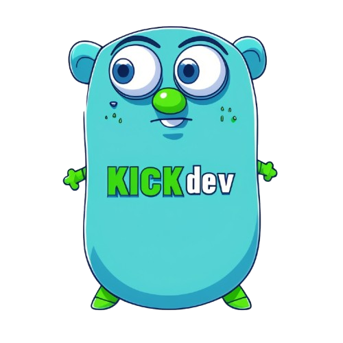

# GoKICK

A KICK API client written in Go.

## Documentation & Examples

See [here](docs/README.md) for a list of endpoints and features this package supports.

## Kick API
If you are looking for the KICK API docs, see the [KICK Developer website](https://dev.kick.com/).

## License

This package is distributed under the terms of the [MIT](LICENSE) license.